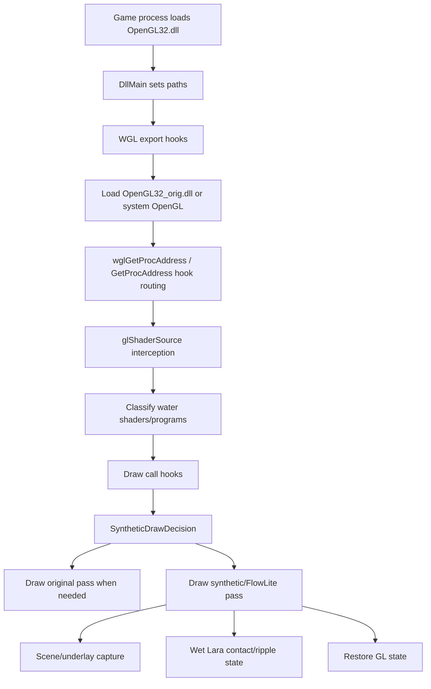

# TR456 Water Proxy Architecture

This document captures the current architecture before larger refactoring work.
It describes the code as it exists now, not the desired end state.

## Rendering Path

The project is not a native Vulkan renderer. The active release path is:

```text
Tomb Raider I-III Remastered
  -> OpenGL32.dll proxy from this project
  -> OpenGL32_orig.dll Mesa/Zink WGL runtime
  -> Vulkan driver
```

The proxy intercepts OpenGL/WGL calls, tracks the game's water shaders and draw
calls, and inserts synthetic water and wet-Lara passes. Vulkan-specific objects
such as descriptor sets, command buffers, push constants, and Vulkan memory
pools are owned by Mesa/Zink, not by this codebase.

## Current Module Map

The proxy now builds from two C translation units. `src/tr456_water_proxy.c`
still declares most shared state, includes the remaining `.inc` modules, and
provides `DllMain`. `src/tr456_proxy_shader_sources.c` is the first small
physical split. The remaining include order is still part of the architecture:

```text
tr456_water_proxy.c
  -> tr456_lab_common.h
  -> tr456_wet_lara_lab.h
  -> tr456_proxy_runtime_config.h
  -> tr456_proxy_shader_sources.h
  -> tr456_proxy_shadow_state.inc
  -> tr456_proxy_bootstrap.inc
  -> tr456_proxy_runtime_config.inc
  -> local shader tracking, diagnostics, contacts, and geometry capture helpers
  -> tr456_proxy_flow_runtime.inc
  -> tr456_proxy_programs.inc
       -> tr456_lab_common.c
       -> tr456_wet_lara_lab.c
  -> tr456_proxy_gl_hooks.inc
  -> tr456_proxy_draw_dispatch.inc
  -> tr456_proxy_wgl_exports.inc

tr456_proxy_shader_sources.c
  -> tr456_proxy_shader_sources.h
  -> configured_shader() from tr456_proxy_runtime_config.inc
```

Because of this model, the remaining `.inc` files can call static functions and
use globals declared earlier in `tr456_water_proxy.c`. This keeps the binary
simple but makes dependency direction implicit and fragile.

The first physical split is intentionally small: shader source factories no
longer depend on include order, while `configured_shader()` remains the narrow
runtime-config boundary they call into.

## Layer Responsibilities

| Area | Files | Current role |
| --- | --- | --- |
| Process bootstrap and chain loading | `tr456_proxy_bootstrap.inc`, `tr456_proxy_wgl_exports.inc` | Finds the game/mod directories, loads the forward OpenGL DLL, resolves WGL/ICD procedures, applies Mesa/Zink environment policy, and exports WGL entry points. |
| Runtime configuration | `tr456_proxy_runtime_config.h`, `tr456_proxy_runtime_config.inc`, `tr456_water.ini`, `profiles/tr456_water.release.ini`, `INI_SETTINGS.md` | Reads INI settings, invalidates cached shader text/defines, builds GLSL `#define` blocks, and exposes the internal runtime-config contract. |
| GL state tracking | `tr456_proxy_shadow_state.inc`, `tr456_proxy_gl_hooks.inc` | Mirrors selected GL state and uniforms so synthetic passes can restore state and read uniforms without excessive driver queries. |
| Shader source loading | `tr456_proxy_shader_sources.h`, `tr456_proxy_shader_sources.c` | Owns synthetic standing-water, FlowLite, and diagnostic shader source entry points. Runtime GLSL goes through `configured_shader()`. |
| Shader/program interception | `tr456_water_proxy.c`, `tr456_proxy_programs.inc` | Tracks original game shaders, classifies water programs, compiles synthetic/FlowLite programs, manages shader binary cache, and applies compatibility policy. |
| Flow classification and frame capture | `tr456_proxy_flow_runtime.inc` | Recognizes flow textures/materials, tracks flow draw profiles, updates water uniforms, captures the scene/underlay textures, and ends per-frame runtime work. |
| Draw replacement and overlays | `tr456_proxy_draw_dispatch.inc` | Hooks draw calls, decides whether original water should be drawn, draws synthetic standing water or FlowLite water, preserves/restores GL state, and draws debug overlays. |
| Wet Lara | `tr456_wet_lara_lab.c`, `tr456_wet_lara_lab.h`, `tr456_lab_common.c` | Detects Lara draw candidates, tracks water contact, emits contact/drip ripples, and renders the wetness overlay. |
| Build/install/package scripts | `tools/*.ps1`, `build.ps1` | Builds the proxy with Zig, installs it into the game directory, cleans old files, and packages Nexus release artifacts. |
| Runtime shaders | `shaders/*.glsl` | External GLSL sources for synthetic standing water and FlowLite water. Runtime INI values are injected as preprocessor defines. |

## Runtime Flow



## Key Extension Points

Add or tune a runtime setting:

1. Add the key to `tr456_water.ini` if it belongs in the active compatibility
   profile, or to `profiles/tr456_water.release.ini` if it is release-only.
2. Document it in `INI_SETTINGS.md` if it is user-facing. If it is deliberately
   hidden, classify it in `docs/SETTINGS_OWNERSHIP.csv` instead.
3. Read and clamp it in `tr456_proxy_runtime_config.inc`.
4. If the shader needs it, add it to `build_shader_defines()`.
5. If packaging depends on it, update `tools/package_nexus_release.ps1` and run
   `tools/audit_ini_settings.ps1 -FailOnPackageDrift -FailOnUnclassified`.

Add or tune a shader path:

1. Add or edit a file in `shaders/`.
2. Add the file to `g_shader_text_cache` if it is loaded by name.
3. Load it through `configured_shader()` so INI define injection, cache
   invalidation, and install packaging stay consistent.
4. Update `tools/install_tr456_water_proxy.ps1` required shader checks.

Shader-facing settings and generated GLSL defines are tracked in
`docs/SHADER_DEFINE_OWNERSHIP.md`.

Add a new draw-time water feature:

1. Add classification state near `SyntheticDrawDecision` or a narrower feature
   struct.
2. Update candidate detection in `tr456_proxy_flow_runtime.inc` or a dedicated
   helper.
3. Wire draw dispatch in `tr456_proxy_draw_dispatch.inc`.
4. Keep original-pass fallback behavior intact.
5. Add a release-off diagnostic toggle if the feature needs support capture.

Add a new compatibility policy:

1. Extend `TrshaderCompatState` and config parsing in `tr456_proxy_programs.inc`.
2. Ensure `trshader_compat_apply_runtime_policy()` fails safe to original water.
3. Include the state in the one-time compatibility report.

## Current Constraints

- The proxy is Windows x64 and Win32/WGL specific.
- The code assumes OpenGL entry points and state. Vulkan resources are not
  visible here because Mesa/Zink owns the Vulkan backend.
- `.inc` modules depend on declaration order. Moving code without prototypes or
  internal headers can break compilation.
- Most runtime state is process-global. This matches the game/proxy model but
  raises risk when adding async work.
- Shader behavior is split between C-side defines and external GLSL files.
  Any shader refactor should preserve this hot-tuning workflow.

## First Physical Split

The first real `.c` module split is the shader source factory layer:

```text
tr456_proxy_shader_sources.h
tr456_proxy_shader_sources.c
```

Why this went first:

- It already has a narrow header boundary.
- Its public surface is only shader source factory functions.
- Its runtime-loaded path depends on `configured_shader()` but does not own
  draw dispatch, GL state replay, framebuffer capture, or Wet Lara state.
- It keeps the external GLSL hot-tuning workflow intact.

Follow-up boundaries to preserve:

1. Keep shader factory functions internal to the proxy DLL; do not create a
   public mod API from them.
2. Keep the build script compiling the new `.c` file alongside
   `tr456_water_proxy.c`.
3. Keep `configured_shader()` as the only runtime-config entry point needed by
   shader source factories.

Draw dispatch should stay in one included module for now. The original-pass
helpers are narrower after the `OriginalPassGuard` cleanup, but the hook layer
still depends on shared `SyntheticDrawDecision`, capture state, Wet Lara replay,
and many GL function typedefs.

## Structure Refactor Stop Rule

This architecture is allowed to stay partly `.inc`-based. The current
structural phase stops when `tools/check_structure_refactor.ps1` passes. Further
module splits should be tied to a concrete bugfix, feature, or testability need,
not general cleanup.
